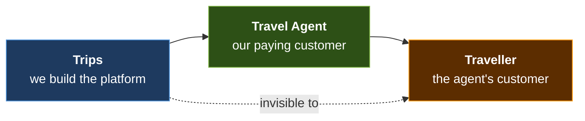
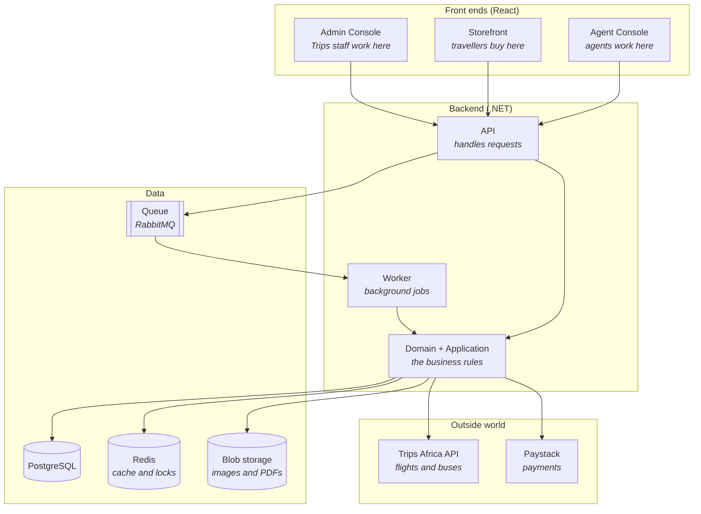
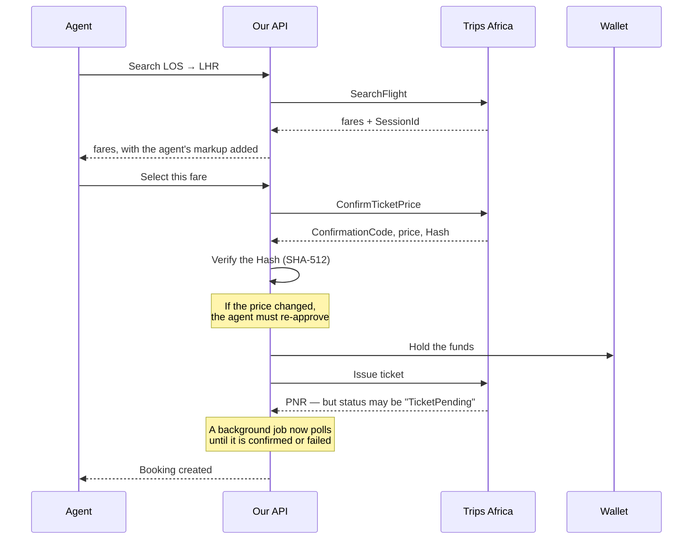
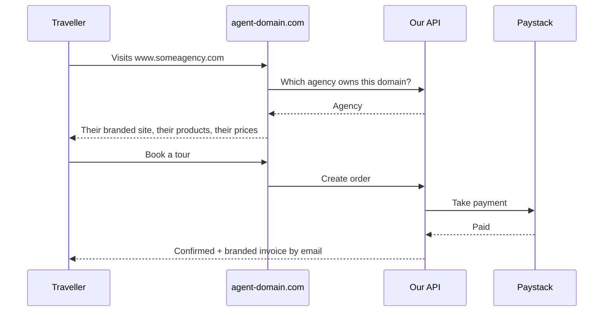

# Trips Agent Platform (NG)

> A B2B2C SaaS that gives every Nigerian travel agent — regardless of size — an all-in-one
> workspace to source flights, build travel products, and sell them from their own branded
> website, without hiring a developer.

**Status:** 🟡 Pre-development. The repository foundation is in place; feature work begins with Milestone 1.

| | |
|---|---|
| **Product** | Trips Agent Platform (NG) |
| **Product Manager** | Divine Anyanwu |
| **Business Analyst** | Boluwatife Sodipo |
| **Backend** | C# / .NET 9 |
| **Frontend** | React 19 + TypeScript (Next.js for the storefront) |
| **Database** | PostgreSQL 16 |
| **Full plan** | [`docs/ARCHITECTURE_AND_DELIVERY_PLAN.md`](docs/ARCHITECTURE_AND_DELIVERY_PLAN.md) |
| **Requirements** | [`docs/FUNCTIONAL REQUIREMENT DOCUMENT.pdf`](docs/FUNCTIONAL%20REQUIREMENT%20DOCUMENT.pdf) |

---

## Table of contents

1. [What we are building](#1-what-we-are-building)
2. [Who uses it](#2-who-uses-it)
3. [Glossary — read this first](#3-glossary--read-this-first)
4. [How the system fits together](#4-how-the-system-fits-together)
5. [Repository map](#5-repository-map)
6. [Tech stack, and why](#6-tech-stack-and-why)
7. [Local setup](#7-local-setup)
8. [Running things](#8-running-things)
9. [Test accounts and seed data](#9-test-accounts-and-seed-data)
10. [Where do I find…?](#10-where-do-i-find)
11. [How we work](#11-how-we-work)
12. [Milestones](#12-milestones)

---

## 1. What we are building

Most travel agents in Nigeria sell over WhatsApp and phone calls. They have no website. To
quote a customer a flight they log into three different airline portals. To take payment they
send account details. To keep track of customers they scroll back through chats.

The Trips Agent Platform gives them one place to do all of it — and gives their customers a
real website to buy from.

### The B2B2C chain

This is the single most important idea in the product. Read it twice.



- **Trips** (us) builds and operates the platform. We charge agents a subscription and a
  transaction fee.
- **The travel agent** is our customer. They log into the *Agent Console*, search flights,
  build tour packages, set their own prices, and publish their own branded website.
- **The traveller** is the *agent's* customer. They browse the agent's website, book, and pay.

**The traveller must never see the Trips brand.** The agent's website is theirs — their logo,
their colours, their domain, their prices. We are the invisible engine underneath. This is
what "white-label" means, and almost every design decision in this codebase follows from it.

### What an agent can do

| Capability | What it means |
|---|---|
| **Sign up and get verified** | Self-service registration, then KYB (business document review) by our admin team |
| **Search and book flights** | One interface across many airlines, via the Trips Africa API |
| **Search and book bus tickets** | Same pipeline, Nigerian road transport operators |
| **Build a branded website** | No-code builder: pick a template, add logo and colours, publish to their own domain |
| **Sell their own products** | Tours, packages, visas and fixed-date group departures they create themselves |
| **Set their own prices** | Markup rules applied automatically on top of our net rate |
| **Take payments** | Card and transfer via Paystack, into their own wallet |
| **Manage customers** | CRM with leads, quotes, a sales pipeline and follow-up reminders |
| **Run a network** | Onboard sub-agents with scoped permissions and spending allowances |
| **See how they're doing** | Sales, revenue and margin dashboards, and exportable reports |

---

## 2. Who uses it

Five distinct people use this system. When you build a feature, know which one you are
building for — their needs conflict more often than you would expect.

| Persona | Who they are | What they need |
|---|---|---|
| **Independent Travel Agent** *(primary)* | Solo operator or a 1–10 person agency. No website today. Sells flights, hotels, visas and tours over WhatsApp | A professional online presence, and one place to search, quote, book and get paid |
| **Agency Owner / Principal Agent** | Runs a small agency with sub-agents or franchisees | To onboard sub-agents, set their markups and spending limits, and see performance across the whole network |
| **Sub-Agent / Agent Staff** | Works under a principal agent's brand | A scoped login to search, quote and book — only within the permissions the principal set |
| **End Customer / Traveller** | The agent's own client, browsing the agent's website | To see tours and packages, get a quote, pay securely and track their booking — without knowing or caring what platform powers it |
| **Trips Admin** | Our own operations team | To manage agent accounts, subscriptions, disputes, content moderation and platform-wide analytics |

---

## 3. Glossary — read this first

This domain has words that do not mean what you would guess. Learning these ten terms will
save you more time than anything else in this README.

| Term | What it means here |
|---|---|
| **Agent** | A registered platform user who sells travel under their own brand. **Our customer.** Not a support agent, not an AI agent |
| **Agency / Tenant** | The business account an agent belongs to. Every row of business data in the database belongs to exactly one agency |
| **Principal Agent** | An agency that can create and manage sub-agents beneath it |
| **Sub-Agent** | An agency operating *underneath* a principal, using the principal's brand, wallet and permissions |
| **Storefront** | The public, branded website we generate for an agent. Also called the *agent site* |
| **White-label** | Delivered under the reseller's brand, with no visible trace of the underlying platform. See §1 |
| **Net Rate** | What Trips charges the agent. The wholesale price. **Never shown to the traveller** |
| **Markup** | The margin the agent adds on top of the net rate |
| **Sell Price** | `net rate + markup + taxes`. What the traveller actually pays |
| **Wallet** | A prepaid balance an agent tops up and spends on bookings |
| **KYB** | *Know Your Business.* Verifying an agency is a real, registered business before they can transact |
| **PNR** | *Passenger Name Record.* The airline's booking reference (e.g. `RE6MIK`) |
| **GDS** | *Global Distribution System.* The wholesale network airlines sell inventory through. We reach it via Trips Africa |
| **Ticket Time Limit** | A hard deadline from the airline. Confirm a price, and you have until this timestamp to issue the ticket or the booking dies |
| **Departure** | A specific dated instance of a tour. One tour ("Zanzibar 5 nights") can have many departures |
| **Group Departure** | A fixed-date departure with a minimum and maximum group size, sold by the seat |
| **Manifest** | The passenger list for a departure, including room assignments |
| **Entitlement** | A feature limit granted by a subscription tier (e.g. `max_sub_agents = 5`) |
| **Minor units** | Money stored as whole numbers of kobo, never as decimals. ₦1,500.00 is stored as `150000` |

> **Money rule:** every amount in this codebase is a `bigint` of minor units, named `*_minor`.
> If you ever type `decimal price` or `float amount`, the build will fail. This is deliberate —
> floating-point money silently loses kobo, and in a ledger that is unrecoverable.

---

## 4. How the system fits together

### The pieces



**Why a separate Worker?** Because booking a flight is not a single request. After the traveller
pays, we have to keep asking the airline "is the ticket issued yet?" for minutes or hours. That
cannot happen inside a web request, so it happens in the Worker. See
[the background jobs section of the plan](docs/ARCHITECTURE_AND_DELIVERY_PLAN.md) for all 30 of them.

### The two flows that matter most

**Flow A — an agent books a flight**



The critical, non-obvious part: **Trips Africa has no webhooks.** Ticket issuance often returns
`TicketPending`, and the only way to learn the real outcome is to poll `GetBookingStatus`
repeatedly. If it ends up cancelled or errored, we must reverse the payment. That polling job is
the most important background job in the system.

**Flow B — a traveller buys from an agent's website**



The traveller never sees the word "Trips". The domain, the logo, the invoice and the email are
all the agent's.

### Multi-tenancy, in one paragraph

Every agency's data lives in the same database, separated by an `agency_id` column on every
table. The application automatically filters every query by the current agency, so you generally
do not write `WHERE agency_id = ...` yourself — it happens for you. **This is also the easiest
way to cause a catastrophic bug in this codebase.** If you ever find yourself bypassing that
filter, stop and ask. There is a test fixture that proves agency A cannot read agency B's data,
and every tenant-scoped feature must pass it.

---

## 5. Repository map

```
trips-agent/
├─ apps/                        Front ends (React + TypeScript)
│  ├─ agent-console/            Where agents work. Vite SPA, login required
│  ├─ storefront/               Traveller-facing agent sites. Next.js, server-rendered for SEO
│  ├─ admin-console/            Trips back-office. Vite SPA, staff only
│  └─ marketing-site/           tripsagent.com — our own marketing and signup
│
├─ packages/                    Shared front-end code
│  ├─ ui/                       Design system. Buttons, forms, tables — used by all three apps
│  ├─ api-client/               TypeScript API client. GENERATED — never edit by hand
│  ├─ contracts/                Shared TypeScript types. Also generated
│  ├─ config/                   Shared ESLint / TypeScript / Tailwind config
│  └─ utils/                    Shared helpers
│
├─ services/                    Backend (.NET)
│  ├─ TripsAgent.Api/           HTTP endpoints. Thin — no business logic lives here
│  ├─ TripsAgent.Worker/        Background jobs and queue consumers
│  ├─ TripsAgent.Domain/        Entities and business rules. Depends on NOTHING
│  ├─ TripsAgent.Application/   Use cases. One class per thing a user can do
│  ├─ TripsAgent.Infrastructure/ Database, caching, outbox. The "how"
│  ├─ TripsAgent.Contracts/     DTOs and events. Source of the generated TS types
│  ├─ TripsAgent.Integrations.TripsAfrica/  Flight and bus supplier
│  ├─ TripsAgent.Integrations.Paystack/     Payments
│  └─ TripsAgent.Documents/     PDF invoices and vouchers
│
├─ tests/
│  ├─ TripsAgent.UnitTests/         Fast, no database
│  ├─ TripsAgent.IntegrationTests/  Real Postgres in Docker
│  ├─ TripsAgent.ArchitectureTests/ Enforces the layering rules below
│  └─ e2e/                          Playwright, drives real browsers
│
├─ db/migrations/               Database schema changes, in order
├─ infra/                       Docker, Terraform, deployment
├─ docs/                        The plan, ADRs, runbooks, the FRD
└─ .github/                     CI pipelines, PR and issue templates
```

### The layering rule

```
Api ──▶ Application ──▶ Domain ◀── Infrastructure
```

`Domain` is the centre and depends on nothing. Business rules go there so they can be tested
without a database. **Arrows never point backwards** — if `Domain` ever references
`Infrastructure`, the architecture test fails the build. That is intentional, and the failure
message will tell you what to do instead.

---

## 6. Tech stack, and why

Every choice here has a reason. They are written down so nobody has to re-argue them in a code
review.

| Layer | Choice | Why |
|---|---|---|
| Backend | .NET 9, ASP.NET Core | Team standard |
| Architecture | Clean Architecture + MediatR | Keeps business rules testable and out of controllers |
| Database | PostgreSQL 16 | Free, portable between AWS and Azure, and has the specific features we need (`ltree` for the agency hierarchy, `jsonb`, table partitioning, row-level security) |
| ORM | EF Core 9 + Npgsql | Automatic tenant filtering; Dapper where we need raw speed for reports |
| Cache | Redis | Flight search caching, domain lookups, and locks that stop double-booking |
| Scheduled jobs | Hangfire | Reliable cron with a web dashboard, and no cloud lock-in |
| Events and sagas | MassTransit + RabbitMQ | Multi-step booking flows with retries; swaps to SQS or Service Bus once we pick a cloud |
| PDFs | QuestPDF | Invoices and vouchers |
| Storefront | Next.js 15 | Agent sites must rank on Google. That requires server-side rendering |
| Consoles | React 19 + Vite | No SEO requirement, so a fast SPA is the right tool |
| Styling | Tailwind + shadcn/ui | One design system across three apps |
| Monorepo | pnpm workspaces + Turborepo | Only rebuilds what changed |
| Tests | xUnit, Testcontainers, Playwright | Integration tests run against a real Postgres, not a fake |

**Why is the cloud not chosen yet?** Because it does not need to be. Everything talks to
interfaces (`IBlobStorage`, `IMessageBus`, `IEmailSender`), so AWS or Azure can be picked later
without rewriting features. Locally, Docker Compose stands in for all of it.

---

## 7. Local setup

> **Not yet available** — the scaffold lands in Milestone 1, week 2. This section is the
> contract for what it will do, and will be filled in with real output as it is built.

### You will need

| Tool | Version | Check with |
|---|---|---|
| .NET SDK | 9.x | `dotnet --version` |
| Node.js | 22.x LTS | `node --version` |
| pnpm | 9.x | `pnpm --version` |
| Docker Desktop | latest, **running** | `docker ps` |
| Git | 2.4x | `git --version` |

### Steps

```bash
# 1. Clone
git clone https://github.com/innovateavitech/trips-agent.git
cd trips-agent

# 2. Copy the environment template and fill in the blanks (ask the team lead for secrets)
cp .env.example .env

# 3. Start Postgres, Redis, RabbitMQ, MinIO and Mailpit
docker compose up -d

# 4. Install front-end dependencies
pnpm install

# 5. Create the database schema and load test data
dotnet run --project services/TripsAgent.Api -- migrate
dotnet run --project services/TripsAgent.Api -- seed

# 6. Start everything
pnpm dev
```

Then open <http://localhost:5173> and log in with the test agent from §9.

### When it goes wrong

| Symptom | Cause | Fix |
|---|---|---|
| `Cannot connect to the Docker daemon` | Docker Desktop is not running | Start Docker Desktop, wait for the whale icon to settle, retry |
| `port 5432 is already allocated` | Another Postgres is running | `docker ps` to find it, or change `POSTGRES_PORT` in `.env` |
| `relation "agencies" does not exist` | Migrations were not applied | Re-run step 5 |
| API starts, front end shows 401 on everything | `.env` is missing or has no JWT secret | Re-do step 2 |
| TypeScript errors in `packages/api-client` | The generated client is stale | `pnpm generate:api` |
| `pnpm: command not found` | pnpm not installed | `npm install -g pnpm` |

Still stuck after 30 minutes? **Ask.** That is not failure, it is the correct move — see §11.

---

## 8. Running things

> Available once the scaffold lands.

| What | Command |
|---|---|
| Everything at once | `pnpm dev` |
| API only | `dotnet watch --project services/TripsAgent.Api` |
| Background worker | `dotnet watch --project services/TripsAgent.Worker` |
| Agent console only | `pnpm --filter agent-console dev` |
| Storefront only | `pnpm --filter storefront dev` |
| Backend tests | `dotnet test` |
| Front-end tests | `pnpm test` |
| Everything CI runs | `pnpm verify` |
| New migration | `dotnet ef migrations add <Name> -p services/TripsAgent.Infrastructure` |
| Reset the database | `pnpm db:reset` |
| Regenerate the API client | `pnpm generate:api` |

| Service | URL |
|---|---|
| API + Swagger | <http://localhost:5000/swagger> |
| Agent console | <http://localhost:5173> |
| Storefront | <http://localhost:3000> |
| Admin console | <http://localhost:5174> |
| Hangfire dashboard *(watch jobs run)* | <http://localhost:5000/hangfire> |
| Mailpit *(all outbound email lands here)* | <http://localhost:8025> |
| RabbitMQ management | <http://localhost:15672> |

---

## 9. Test accounts and seed data

> Populated when seeding is built. No real credentials ever go in this file — secrets live in
> `.env`, which is git-ignored.

| Role | Email | Password |
|---|---|---|
| Trips Super Admin | `admin@trips.test` | *see `.env.example`* |
| Verified Agent | `agent@demo.test` | *see `.env.example`* |
| Sub-Agent | `subagent@demo.test` | *see `.env.example`* |
| Pending-verification Agent | `pending@demo.test` | *see `.env.example`* |

Seeded data includes a verified agency with a published storefront on
`demo.localhost:3000`, a funded wallet, two tour products, one group departure, and a
handful of customers and leads — enough to exercise every screen without clicking through
setup each time.

**Sandboxes:** Trips Africa staging (`api.staging.trips.ng`) and Paystack test mode. Ask the
team lead for keys. **Never commit them.**

---

## 10. Where do I find…?

| I want to change… | Look in |
|---|---|
| A screen an agent sees | `apps/agent-console/src/features/` |
| A page a traveller sees | `apps/storefront/app/` |
| A screen Trips staff see | `apps/admin-console/src/features/` |
| A button, input or table style | `packages/ui/` |
| An API endpoint | `services/TripsAgent.Api/Endpoints/` |
| What happens when a user does something | `services/TripsAgent.Application/` |
| A business rule | `services/TripsAgent.Domain/` |
| A database table | `services/TripsAgent.Infrastructure/Persistence/Configurations/` |
| The database schema itself | `db/migrations/` |
| How we talk to Trips Africa | `services/TripsAgent.Integrations.TripsAfrica/` |
| How we take payment | `services/TripsAgent.Integrations.Paystack/` |
| A background job | `services/TripsAgent.Worker/Jobs/` |
| How prices and markup are calculated | `services/TripsAgent.Domain/Pricing/` |
| Wallet and ledger logic | `services/TripsAgent.Domain/Payments/` |
| An invoice or voucher layout | `services/TripsAgent.Documents/` |
| An email template | `services/TripsAgent.Infrastructure/Notifications/Templates/` |
| CI pipelines | `.github/workflows/` |

---

## 11. How we work

**Read [`CONTRIBUTING.md`](CONTRIBUTING.md) before your first commit.** The essentials:

- **Nobody pushes to `main`.** It is protected. All changes arrive by pull request, reviewed by
  at least one person.
- **Branch names:** `feat/M1-wallet-topup`, `fix/login-lockout-counter`, `chore/upgrade-efcore`
- **Commit messages** follow [Conventional Commits](https://www.conventionalcommits.org/):
  `feat(wallet): credit agent wallet on successful top-up`. A hook checks this locally, so a bad
  message fails in two seconds instead of twenty minutes.
- **We squash-merge.** Your branch history can be as messy as you like; `main` stays clean.
- **Run `pnpm verify` before you push.** It runs what CI runs.

New here? Start with [`docs/onboarding.md`](docs/onboarding.md) and pick up an issue labelled
`good-first-issue`.

### A note on asking questions

This is a large system with a lot of unfamiliar domain vocabulary, and everyone on this team is
early in their career. Getting stuck is expected and is not a reflection on you.

**Rule of thumb: try for 30 minutes, then ask.** An hour of your time is worth more than the
appearance of independence. Ask in the open team channel rather than by direct message — someone
else almost certainly has the same question, and the answer becomes searchable.

---

## 12. Milestones

Full detail in [`docs/ARCHITECTURE_AND_DELIVERY_PLAN.md`](docs/ARCHITECTURE_AND_DELIVERY_PLAN.md).

### Milestone 1 — Tenanted spine + live ticketing

*An agent signs up, gets verified, funds a wallet, searches a real flight, books it with their
markup applied, and receives a ticketed PNR and a branded invoice — and if ticketing fails, the
money is provably returned.*

Repo foundation · authentication · KYB · agencies and tenancy · wallet and double-entry ledger ·
Paystack · markup engine · the Trips Africa integration · the checkout saga · invoices.

We tackle the hardest, riskiest integration first, on purpose.

### Milestone 2 — Storefront, catalog and customer commerce

*An agent publishes a branded site on their own domain with SSL, lists tours, visas and group
departures, and a real traveller browses, requests a trip, gets a quote, and checks out.*

Website builder · custom domains · product catalog · group departures with deposits and
installments · cart and guest checkout · CRM · vouchers.

### Milestone 3 — Network, monetisation, intelligence and back-office

*Trips operates the platform; agencies run sub-agent networks; everyone gets analytics.*

Sub-agents and allowances · subscription tiers and entitlements · recurring billing · the admin
console · dashboards and reporting · loyalty and reviews · security hardening.

---

## Open questions

27 items still need answers from the client, listed in
[§7 of the plan](docs/ARCHITECTURE_AND_DELIVERY_PLAN.md). None of them block Milestone 1, but
the first five must be settled before Milestone 2 because they change money flows, not screens:

- Do agents hold their own Trips Africa credentials, or does the platform transact as one merchant?
- Who is the merchant of record for traveller payments?
- **Who fronts the money between checkout and ticketing?** The traveller's card settles tomorrow;
  the ticket must be issued now. Someone funds that gap.
- Is the platform fee added to the traveller's price, or taken from the agent's margin?
- How do flight cancellations work? The supplier documents bus cancellation but not flight.

---

## Licence

Proprietary — © Avitech Innovate. All rights reserved.
