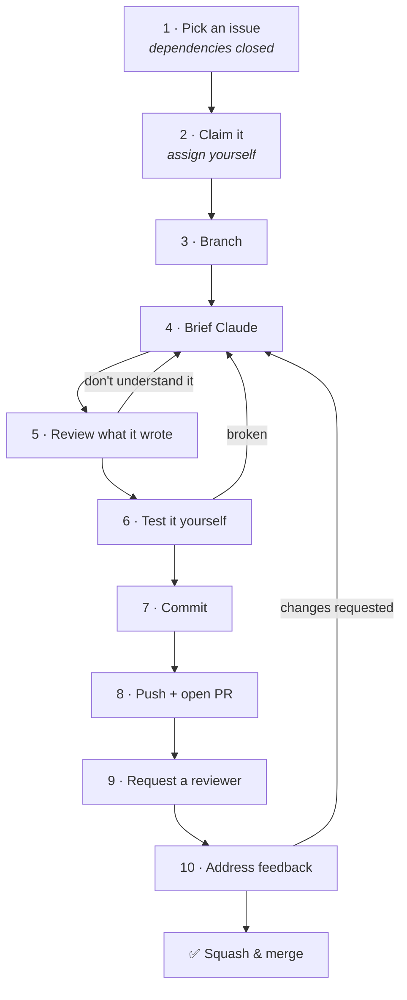

# Working with Claude Code

How to take one issue from the backlog and turn it into a merged pull request.

This is the loop you will run dozens of times. Read it once properly; after that the
[quick reference](#quick-reference) at the bottom is all you need.

> **The one thing to understand before you start.**
> Claude writes the code. **You are responsible for it.** When you open a pull request, you are
> saying *"I have read this, I understand it, and I believe it is correct."* If a reviewer asks
> why a line exists, "Claude wrote it" is not an answer. That is not a rule to make your life
> harder — it is what makes you a developer rather than a person who forwards output.

---

## The loop at a glance



---

## 1 · Pick an issue

Open [the issue list](https://github.com/innovateavitech/trips-agent/issues), or from your terminal:

```bash
# everything available
gh issue list

# safe for your first few
gh issue list --label good-first-issue

# one module — issues are titled "Module: What it is" and carry a module: label
gh issue list --label "module:wallet-ledger"
gh issue list --label "module:flight-bus-booking"

# just Milestone 1
gh issue list --milestone "M1 — Tenanted spine + live ticketing"
```

Issues are grouped by **module** in [docs/BACKLOG.md](BACKLOG.md) — 22 of them, from
`Platform Foundation` through to `Security`. Working inside one module for a few issues in a row
is usually faster than hopping between them, because the context carries over.

**Check two things before you claim it:**

1. **Nobody is assigned.** If someone is, pick another one.
2. **Its dependencies are closed.** Every issue lists `**Depends on:** #N`. Check each one:

```bash
gh issue view 11 --json state,title --jq '"\(.state)  \(.title)"'
```

If a dependency is still `OPEN`, **pick something else**. Building against something that does not
exist yet means doing the work twice.

[docs/BACKLOG.md](BACKLOG.md) shows the whole dependency order in nine waves if you would rather
see the shape of it.

---

## 2 · Claim it

```bash
gh issue edit 42 --add-assignee @me
```

Do this *before* you start, so nobody duplicates your work.

---

## 3 · Create your branch

```bash
git checkout main && git pull origin main
gh issue develop 42 --name feat/M1-wallet-topup --checkout
```

`gh issue develop` creates the branch **and links it to the issue**, so GitHub shows the
connection automatically.

Prefer plain git? That works too:

```bash
git checkout -b feat/M1-wallet-topup
```

Naming rules are in [CONTRIBUTING.md §2](../CONTRIBUTING.md#2-how-branching-works-here).

---

## 4 · Brief Claude Code

```bash
claude
```

Claude reads [CLAUDE.md](../CLAUDE.md) automatically, so it already knows the product, the
architecture, and the seven hard rules. **You do not need to re-explain the project.**

What you *do* need to give it is the issue and the constraints.

### A good opening prompt

```
Read GitHub issue #42 with: gh issue view 42

Implement it. Before writing code, tell me your plan and which files
you'll touch, and wait for me to confirm.

Relevant context:
- docs/ARCHITECTURE_AND_DELIVERY_PLAN.md §2.9 has the schema design
- Follow the patterns already in services/TripsAgent.Application/
```

Three things make that prompt work:

| | Why |
|---|---|
| **It points at the issue** rather than paraphrasing it | The issue already has the acceptance criteria. Retyping them badly loses detail |
| **It asks for a plan first** | Cheaper to correct a plan than a thousand lines of code |
| **It names the relevant docs** | Claude has a big codebase to search. Pointing at the right section saves time and reduces guessing |

### Prompts that work

```
Explain what this code does before you write it — I need to understand
it well enough to defend it in review.

Show me the test first, then the implementation.

That query bypasses the tenant filter. Why? Is that safe here?

I don't understand line 40. Explain it as if I've never seen EF Core.

Stop. That's more than the issue asked for. Just do the acceptance criteria.
```

### Prompts that cause problems

```
❌ "fix issue 42"
   No plan, no constraints. You'll get something, but you won't know if it's right.

❌ "make the tests pass"
   Invites deleting the assertion instead of fixing the bug.

❌ "just do whatever"
   You are now responsible for code nobody chose.

❌ "commit and push"  (before you've read the diff)
   Skips the only step that makes you the author rather than the courier.
```

### Ask it to explain — every time

You are going to be asked about this code in review. Use Claude to actually learn it:

```
Walk me through what you just wrote, file by file.
Why did you use a distributed lock here instead of a database transaction?
What breaks if two people do this at the same time?
```

This is the highest-value thing in this entire guide. Ten minutes here turns a PR you cannot
defend into one you can.

---

## 5 · Review what Claude wrote

**Read every line before you commit it.**

```bash
git diff
```

Ask yourself four questions:

1. **Do I understand what this does?** If no → ask Claude to explain. Do not proceed.
2. **Does it do what the issue asked, and only that?** Extra "helpful" changes belong in another PR.
3. **Does it break any of the hard rules?** See the red flags below.
4. **Would I be comfortable explaining this in review?** If not, you are not finished.

### 🚩 Red flags — stop and question these

Claude is good, but it is not infallible, and this codebase has rules a general-purpose assistant
will not always respect. If you see any of these, push back before committing.

| Red flag | Why it matters | What to say |
|---|---|---|
| `decimal` or `double` for money | Floating point loses kobo. In a ledger that is unrecoverable | *"Money must be `long` minor units — see CLAUDE.md rule 2"* |
| `.IgnoreQueryFilters()` | Reads **every agency's data at once**. Leaks one travel agency's customers to another | *"Why is the tenant filter bypassed? Is that one of the audited admin cases?"* |
| A retry around the ticket-issue call | Issues a **second real ticket** we cannot easily refund | *"Read docs/adr/0003 — issue is never retried"* |
| `git commit --no-verify` suggested | Skips the hooks that stop secrets and bad commits | *"Why is the hook failing? Fix the cause, not the check."* |
| Hard-coded "Trips" in anything a traveller sees | The whole product is that we are invisible | *"This is traveller-facing — pull branding from the agency record"* |
| A hard-coded colour, or `bg-blue-500` | Our preset replaces Tailwind's palette, so it renders **unstyled**. And two blues means drift | *"Use a token — see docs/DESIGN_SYSTEM.md"* |
| A real API key or password in a file | Ends up in git history permanently | *"Move to .env and add a placeholder to .env.example"* |
| Deleting or weakening a test to make it pass | Hides the bug instead of fixing it | *"Restore the test. Why is it actually failing?"* |
| Way more files changed than the issue needs | Unreviewable, and mixes unrelated risk | *"Revert the extras — that's a separate PR"* |

**Disagreeing with Claude is part of the job.** It will accept a correction and explain its
reasoning. If after that you still think it is wrong, you are probably right — ask in the team
channel.

---

## 6 · Test it yourself

Do not take "the tests pass" on trust. Run them, and then actually use the thing.

```bash
pnpm verify        # everything CI will run, including check:design
```

Then run the app and exercise the feature by hand. The issue's **How to test** section tells you
exactly what to click.

```bash
docker compose up -d
pnpm dev
```

If it needs a screenshot for the PR, take it now.

---

## 7 · Commit

Review your own diff one chunk at a time — this catches an astonishing amount:

```bash
git add -p
```

Then commit:

```bash
git commit -m "feat(wallet): credit agent wallet on successful top-up"
```

Claude can draft the message for you:

```
Write a conventional commit message for these changes.
```

The `commit-msg` hook validates the format and rejects it in about two seconds if it is wrong.
Format rules: [CONTRIBUTING.md §3](../CONTRIBUTING.md#3-writing-commit-messages).

---

## 8 · Push and open the PR

```bash
git push -u origin feat/M1-wallet-topup
gh pr create --fill
```

`--fill` uses your commit message. **Then improve it** — open the PR on GitHub and fill in the
template properly, because the reviewer reads this before they read a line of code.

The field that matters most is **Why**. The diff already shows *what* changed; only you can
explain the reason.

Ask Claude for a first draft if it helps:

```
Draft a PR description for this branch using
.github/pull_request_template.md. Explain WHY, not just what.
```

Then edit it so it is in your words and actually true.

### Link the issue

Put this in the description so the issue closes automatically on merge:

```
Closes #42
```

---

## 9 · Request a reviewer

```bash
gh pr edit --add-reviewer Sayrikey1
```

Or at creation time:

```bash
gh pr create --fill --reviewer Sayrikey1
```

**Some reviewers are requested automatically.** [`CODEOWNERS`](../.github/CODEOWNERS) routes
anything touching payments, the ledger, database migrations, tenancy or the supplier integration
to the tech lead — you do not need to do anything for those.

**Then say something in the team channel.** GitHub notifications get buried. A one-line
*"opened #83, ready for review when you get a chance"* is not nagging, it is how work moves.

### While you wait

Do **not** sit idle. Pick up the next issue whose dependencies are closed and start it on a new
branch. Your PR will still be there.

---

## 10 · Address the feedback

Comments on your PR are the process working, not a judgement of you. Everyone's PRs get
comments, including the lead's.

You can hand a review comment straight to Claude:

```
A reviewer said: "This will throw if the wallet is null — needs fixing
before merge." Fix it and add a test that covers the null case.
```

Then:

```bash
git add -p
git commit -m "fix(wallet): handle a null wallet on first top-up"
git push
```

Just push to the same branch — no need to start over. The PR updates itself.

**Reply to every comment**, even if only *"good catch, fixed in abc1234"*. Silence makes a
reviewer wonder whether you saw it.

If you disagree, say so and explain why. Reviewers are wrong sometimes, and a reviewer who
learns something from your reply is a good outcome.

Once it is approved and green, **Squash and merge**. Your branch deletes itself. Go back to step 1.

---

## Quick reference

```bash
# 1-3  pick, claim, branch
gh issue list --label good-first-issue
gh issue edit 42 --add-assignee @me
git checkout main && git pull origin main
gh issue develop 42 --name feat/M1-my-task --checkout

# 4    brief Claude
claude
#     → "Read issue #42 with gh issue view 42. Plan first, then wait for me."

# 5-6  review and test  ← the steps that make it YOUR code
git diff
pnpm verify

# 7-9  commit, push, PR, reviewer
git add -p
git commit -m "feat(scope): what this does"
git push -u origin feat/M1-my-task
gh pr create --fill --reviewer Sayrikey1

# 10   after feedback
git add -p && git commit -m "fix(scope): address review" && git push
```

---

## FAQ

**Claude wrote something I don't understand. Do I have to?**
Yes. Ask it to explain until you do. If it still will not click, ask in the team channel — that
is a normal thing to do, and someone explaining it to you is faster than you guessing.

**Claude and CLAUDE.md disagree. Who wins?**
CLAUDE.md. Point Claude at the specific rule and it will correct itself. If you think the rule
itself is wrong, that is a conversation worth having — open an issue rather than quietly ignoring it.

**Can I use Claude for the review comments too?**
Yes. Paste the comment and let it draft the fix. Still read the result.

**How big should a PR be?**
Under ~400 changed lines. A 200-line PR gets a careful review; a 2,000-line PR gets an approval
nobody actually read.

**The issue turned out to be bigger than it looked.**
Say so in a comment on the issue and split it. That is good judgement, not failure.

**I hit one of the 27 open client questions.**
Stop and flag it in the team channel. Do not guess. Guessing on a money question costs far more
to unwind than the delay costs to wait. They are listed in
[§7 of the plan](ARCHITECTURE_AND_DELIVERY_PLAN.md).

**A hook is blocking me and I'm in a hurry.**
Read what it says — it is almost certainly correct. `--no-verify` exists for genuine false
positives, not for hooks that are right. If you are unsure, ask.

**I broke something on main.**
You cannot push to `main`, so you almost certainly have not. See
[CONTRIBUTING.md §8](../CONTRIBUTING.md#8-when-things-go-wrong) — nearly everything in git is
recoverable, and `git reflog` finds the rest.

---

## Related

| | |
|---|---|
| [CLAUDE.md](../CLAUDE.md) | What Claude knows about this project, and the seven hard rules |
| [CONTRIBUTING.md](../CONTRIBUTING.md) | Git workflow, commit format, recovering from mistakes |
| [docs/BACKLOG.md](BACKLOG.md) | All 70 issues in dependency order |
| [docs/onboarding.md](onboarding.md) | Your first week |
| [README.md](../README.md) | The product, personas, glossary, setup |
